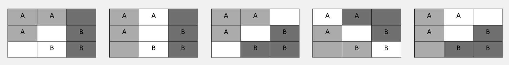
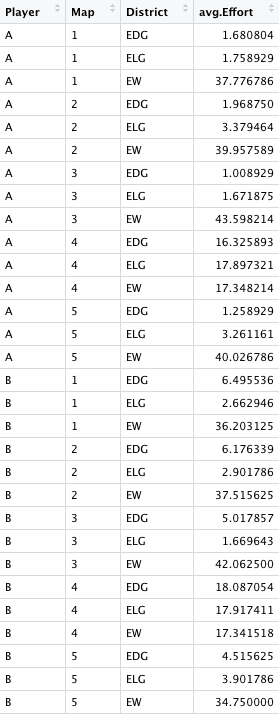

```{r setup, include=FALSE}
knitr::opts_chunk$set(echo = TRUE)
```

## Motivation

## Model

## Design

  Using the Zurich Toolbox for Ready-made Economic Experiments (Fischbacher, 2007), or Ztree, and The TIDE Lab at The University of Alabama, we developed a setting in which subjects compete against one another across five differently configured maps for a prize of 80 lab dollars, or 20 USD. To avoid experimenter demand effects we use normative language an phrase the competition as an internal sales competition. Each round subjects are randomly matched with an opponent; one subject is Player A and the other is Player B. Subjects complete a series of training exercises in order to ensure they understand how their efforts, or bids, relate to their potential payoffs and how it is they win any given zone, district, or map. A map consists of three districts that are defined by their color: dark gray, light gray, and white. Each district contains three zones. The training exercises walk through these different concepts, testing subjects on their understanding of each and providing them an opportunity to practice, but without giving away the maps on which subjects will actually compete. Player A and Player B both have three guaranteed zones in any given map. The configurations are best seen in Figure \ref{fig:maps}. 
  
```{r maps, echo=FALSE, out.width="100%", fig.align='center', fig.cap="\\label{fig:figs}Maps 1 through 5 in order from left to right."}

```
  
  For maps 1 and 5 the configuration of these pre-determined zones provides an advantage to Player B and Player A respectively. Any zone that is not pre-determined can be thought of as being open. A subject wins an open zone with probability $\frac{e_{mi}}{e_{mi}+e_{mj}}$ where $e_{mi}$ is the effort/bid chosen by player $i \in \{1,2\}$ in map $m\in \{1,2,3,4,5\}$ for $i \not= j$. To win a district a subject must win 2/3 of the zones in that district and to win a map a subject must win 2/3 the districts of that map. Subjects are paid for the outcome of a randomly chosen round. It is worth noting that total bids for any given map may not exceed 80 lab dollars, the contest prize. 
  For each round in Stage 1 (the first 10 potentially paid rounds) a map is chosen at random and the outcome of that map determines the subjects' potential payoff for that round. This ensures subjects have proper incentive to make thoughtful decisions for each map. For the next three rounds (Stage 2) subjects are also asked for their map preference. In other words, subjects identify on which map they would like to compete, enabling us to identify whether participants gerrymander when given the opportunity. In Stage 2 a map is chosen at random from the map selections of paired subjects in order to maintain incentive for thoughtful decisions on every map, not just the one chosen by the relevant subject. For the final round (Stage 3) subjects are told that their player type, A or B, is not yet determined, but that they must pick which map they would like to compete on nonetheless. After subjects make their map choice they are assigned to either Player A or Player B and must choose efforts with this knowledge. The stage then proceeds as Stage 2. For each Stage, after map selections and bids are made the results of the contest for each map are displayed with the randomly chosen map highlighted to showcase which map could determine the subjects' earnings. The information shown to subjects includes their bids for every district in every map, their opponent's bids in every district in every map, their probability of winning any given district, their probability of wining the map, and their payoff for each map.

## Theory

  The use of five separate maps is important to our theoretical calculations. For each map a subject's probability of winning is tied directly to their bids and the bids of their opponent. The functional form of these probabilities, as functions of each player's bid, differ depending on which map configuration is considered. Using these probabilites we construct a simple expected payoff maximization problem for each map and calculate the optimal bidding strategies as functions of value $v$. The optimal total bidding strategies for maps 1, 2, 3, 4, and 5 are $\frac{1}{4}v$, $\frac{1}{4}v$, $\frac{3}{8}v$, $\frac{3}{8}v$, and $\frac{1}{4}v$ respectively. The design of maps 1, 2, 3, and 5 are such that only the White district actually effects the probability a player wins the contest. In map 4, however, all three districts are competitive and so the $\frac{3}{8}v$ optimal bid is actually $\frac{1}{8}v$ per district. Another feature of our design are the advantaged maps, maps 1 and 5, but interestingly the optimal bids are not player dependent for these maps. Maps 2, 3, and 4 are symmetric.
  Map selection is also a theoretical question, though a relatively simple one. Assuming a subject is only interested in winning the contest then they should pick the map that provides them the greatest chance of winning. That is, during Stage 2 Player A should choose map 5 and Player B should choose map 1. We make no theoretical claims regarding map selection in Stage 3 as this requires further assumptions on subject behavior.

## Results

#### Map behavior

For starters, behavior for each map is in line with expectations in terms of *where* subjects should focus their efforts. That is, subjects rarely bid in noncompetitive districts. A few subjects start off biding in noncompetitive districts, but quickly update and change their strategy after the first couple of rounds. A handful of subjects bid in noncompetitive districts for the majority of rounds suggesting they did not fully understand the impact of such a strategy on their chances of winning the contest. For the most part, even if subjects bid in noncompetitive districts, those bids were far less than their bids in the competitive White district. In map 4, where every district is competitive, we observe similar distributions of bids across each district. This is expected, though overbidding relative to the theoretical benchmark is evident here as well. Overbidding is also evident in maps 1, 2, 3, and 5, which was somewhat expected given the literature surrounding similar contests.

- Out of 896 bids in map 4, 155 (or 17.3%) subjects bid positive values in only two districts.

- Figure \ref{fig:avg.bids} contains information on average bids for each district by player role within each map.

```{r avg.bids, echo=FALSE, out.width="50%", fig.align='center', fig.cap="\\label{fig:avg.bids}Average bids by role in each district for each map."}

```

- We find that, using the modal map selection for each subject in Stage 2, out of 64 observations 44 subjects chose the gerrymandered map. This equates to 68.75% of the sample. (If we do not use the modal measure this percentage drops modestly to 65.63%)

- In Stage 3, 14%, 12%, 34%, 23%, and 14% of the sample choose maps 1 through 5 respectively. These percentages sum to 98% due to a subject excusing themselves from the map selection part of the final round.

#### Map selection

Using the mode of map selection over the three rounds of Stage 2, subjects overwhelming choose the map that provides them with an advantage. In other words, we find evidence that gerrymandering occurs in our laboratory setting. Map selection in Stage 3, which is a one-shot choice in the final round, identifies maps 3 and 4 as the prefered maps when a subject does not know their player type in advance. Maps 1, 2, and 5 are each chosen with relatively similar frequency.